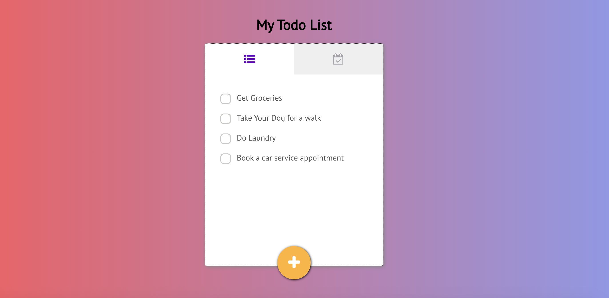

# Todo List App

A Simple Todo List App where we can add the list items and show completed list items in a seperate tab. Build with React, Redux, Scss and Firebase. This project was build fully using functional components and react hooks. 

## Project Screen Shot(s)



## Project setup
Clone down this repository. You will need node and npm installed globally on your machine.

Installation:
```bash
npm install
```

To Start Server:
```bash
npm start
```

To Run Test Suite:
```bash
npm test
```
To Visit App:
```bash
localhost:3000
```